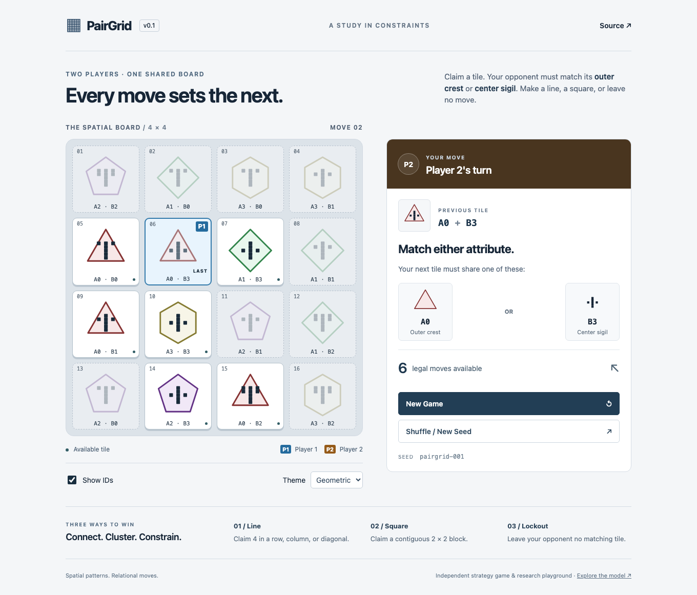

# PairGrid

A generalized constraint-placement strategy game: every move changes where your opponent can play.

**[Play](https://thedisciple.github.io/pairgrid/) · [Project Site](https://pairgrid.humandmc.chatgpt.site) · [Source](https://github.com/thedisciple/pairgrid)**



Claim any tile to start. The next player must choose an unclaimed tile with the **same A attribute OR the same B attribute**. Your choices both build a spatial pattern and restrict your opponent. Play locally with a second person; no installation or account is needed.

Win by claiming a row, column, diagonal, or contiguous 2×2 square—or by leaving your opponent no matching tile while unclaimed tiles remain.

## Project links

- [Play PairGrid](https://thedisciple.github.io/pairgrid/) — canonical GitHub Pages application.
- [Project Site](https://pairgrid.humandmc.chatgpt.site) — visual introduction and research direction, with the canonical game embedded.
- [Source](https://github.com/thedisciple/pairgrid) — engine, application, tests, and documentation.

## The model

For an N×N board, two independent attribute sets each have N values:

```text
A = {A0, …, A(N−1)}
B = {B0, …, B(N−1)}
Tiles = A × B
```

Every ordered pair appears exactly once. A seed deterministically shuffles those N² identities onto spatial cells. For example, after choosing:

```text
A2 + B3
```

the next move must satisfy:

```text
next.a == A2 OR next.b == B3
```

**A2 and B3 are semantic game identifiers. Their visual crest/sigil representation belongs to the UI only.** The engine compares numeric IDs; it has no concept of color or shape. The **Show IDs** control and **Debug IDs** theme make the game readable without interpreting the procedural graphics.

Two structures coexist:

- **Spatial structure:** cell coordinates determine winning lines and rectangles.
- **Constraint structure:** tile identities determine which move may follow another. Its graph is the rook graph **K_N □ K_N**, the Cartesian product of two complete graphs. Each tile has 2(N−1) neighbors before occupancy removes choices. These graph coordinates are attribute coordinates, not physical board coordinates.

Every shuffle preserves the same constraint graph but changes its relationship to spatial wins. This makes board classification, exact search, and rule-space experiments interesting questions. No solved-game or strategic-strength claims are made in this release.

## Play and rules

The browser opens immediately on a 4×4 game:

```ts
const rules = {
  size: 4,
  lineLength: 4,
  blockWidth: 2,
  blockHeight: 2,
  lockoutWins: true,
};
```

Player 1 opens on any tile. Players alternate, permanently claiming one legal tile per turn. Occupied tiles cannot be chosen. Legal choices are highlighted after every move. `P1` and `P2` labels identify ownership independently of color.

Terminal evaluation follows this order:

1. A configured spatial pattern completed by the move wins immediately.
2. A full board with no spatial win is a **draw**.
3. Otherwise, if the next player has no legal move, the last player wins by **lockout** when `lockoutWins` is true. With `lockoutWins: false`, this is a **no-legal-moves draw**.

The full-board check comes before lockout because lockout requires unoccupied tiles. No passes are allowed. Terminal positions have no legal moves and reject further moves.

Lines are contiguous in horizontal, vertical, and either diagonal direction; there is no wrapping. Rectangles may start anywhere, with the configured width and height; dimensions are not implicitly rotated. If one move completes several patterns, the result reports the first in horizontal → vertical → diagonal → block order. This only selects the reported reason, not the winner.

**New Game** restarts the same seed. **Shuffle / New Seed** starts a different deterministic board and puts its seed in the URL; sharing that URL reproduces the starting board, not the move history. A reload starts a fresh game from that seed. Browser play is intentionally limited to 4×4 in v0.1.

## Engine and presentation

```text
apps/web                         packages/engine
React UI                         Numeric tile identities
Procedural crests & sigils  ───→  Seeded board generation
Themes, labels, SVG, CSS          Immutable moves & results
Accessibility                    Validated replay
```

The dependency is **web → engine**, never the reverse. The engine has zero runtime dependencies, compiles against `ES2022` without DOM types, and produces Node-compatible ESM and declarations. A boundary check rejects nonlocal engine imports. Engine tests do not import the web application.

State uses a shared immutable board, a flat row-major ownership array (`0`, `1`, `2`), a last-move index, and an ordered move history. Applying a move copies ownership/history while sharing board identities. Runtime freezing protects returned state. Future solvers can reuse these semantics and later introduce a measured internal search representation; v0.1 does not attempt to optimize an unimplemented solver.

### Engine API

```ts
import {
  DEFAULT_RULES,
  createGame,
  getLegalMoves,
  applyMove,
  getResult,
  serializeGame,
  deserializeGame,
} from "@pairgrid/engine";

const start = createGame(DEFAULT_RULES, "experiment-001");
const next = applyMove(start, getLegalMoves(start)[0]!);
console.log(getResult(next));
const restored = deserializeGame(serializeGame(next));
```

`generateBoard(rules, seed)` is also exported. A move is a zero-based cell index: `row * size + column`. Illegal moves throw explicit errors. Seed strings are used exactly as supplied, including case, whitespace, and Unicode code units.

Replay format v1 stores `{ version, rules, seed, moves }`. Deserialization regenerates the board and reapplies each move; it never trusts serialized ownership or results. Changing the shuffle algorithm requires a new replay version. See [the engine notes](docs/engine.md) for the deterministic contract and input limits.

### Procedural visual language

All mapping lives in `apps/web/src/visual/`:

- **A / crest:** an outer polygon generated from index-derived side count, orientation, and repeated bands. Color is a redundant cue.
- **B / sigil:** a monochrome central stem with symmetric branches enumerated from index bits on a logical grid.
- **geometric:** the default SVG presentation.
- **debug:** canonical A/B text only.

There are no icon packs, emoji tiles, downloaded artwork, or finite hand-maintained symbol lists. The first twelve indices have distinct geometric descriptors even without color. Generators accept arbitrary non-negative JavaScript safe integers. They remain deterministic beyond that range of human visual optimization, but do not promise globally unique or human-distinguishable graphics at arbitrarily high IDs. Canonical semantic IDs remain the source of truth.

## Run locally

Use **Node.js 22.12+** (Node 22 is used in CI) and **pnpm 11.19.0**.

```sh
npm install --global pnpm@11.19.0
git clone https://github.com/thedisciple/pairgrid.git
cd pairgrid
pnpm install --frozen-lockfile
pnpm dev
```

Open **http://127.0.0.1:5173/pairgrid/**. For a production preview:

```sh
pnpm build
pnpm preview
```

Open **http://127.0.0.1:4173/pairgrid/**.

## Validate

Run from the repository root:

```sh
pnpm typecheck
pnpm test:engine
pnpm test:web
pnpm test
pnpm check:boundary
pnpm build
pnpm exec playwright install chromium
pnpm test:e2e
```

`pnpm check` runs type checking, the architecture boundary check, all unit/component tests, and the production build. Browser tests run separately against the production preview.

Engine coverage includes board uniqueness, seed determinism, a fixed shuffle reference, legal/illegal moves, alternating ownership, immutable state, both diagonals, off-origin blocks, shorter lines, rectangular blocks, terminal precedence, full-board draws, and 100 deterministic complete-game replays. Frontend tests cover visual descriptors, semantic labels, keyboard play, themes, IDs, restart, and terminal UI. Chromium tests cover desktop and mobile play, seed URLs, reload reproducibility, and layout bounds.

## Repository layout

```text
packages/engine/
  src/          Types, RNG, board, moves, wins, game, serialization
  test/         Pure domain tests
apps/web/
  src/
    components/ Board and SVG renderer
    visual/     Procedural descriptors, two themes, semantic labels
    test/       Visual and React interaction tests
  e2e/          Chromium interaction and mobile checks
scripts/        Engine dependency-boundary verification
.github/        Validate and deploy workflow
docs/           Model decisions, deployment notes, preview
```

## Deployment

Pushes to `main` run validation and publish `apps/web/dist` through GitHub Actions to GitHub Pages. Pull requests validate without deploying. Vite uses `base: '/pairgrid/'` so asset URLs work under the repository path. See [deployment notes](docs/deployment.md) for repository setup and companion Site maintenance.

## v0.1 scope and future research

**Implemented:** deterministic configurable engine, immutable state, replay validation, local two-player 4×4 play, procedural visuals, two themes, semantic accessibility labels, automated tests, and static deployment.

**Future work:**

1. An exact 4×4 minimax/alpha-beta solver and reproducible position evaluation.
2. Game-theoretic classification of shuffled boards.
3. Rule-space experiments and principled configurations for larger boards.
4. MCTS baselines.
5. Policy/value learning with explicit evaluation protocols.
6. Graph neural networks that represent both spatial and attribute relationships.

The engine structurally supports larger boards (up to a documented allocation limit of N=256); that is not evidence that larger-board rules are balanced or visually practical. No solver, MCTS, ML, backend, accounts, or network multiplayer is included.

## Acknowledgements and license

PairGrid studies ideas inspired by abstract constraint-placement games including **Okiya** and **Kamon** by **Bruno Cathala**. It is an independent implementation and research project, not affiliated with or endorsed by Bruno Cathala or the publishers of those games. No original artwork, rulebook text, source code, or copyrighted game assets are used.

PairGrid's code and original procedural graphics are available under the [MIT license](LICENSE). Referenced game names remain the property of their respective owners.
